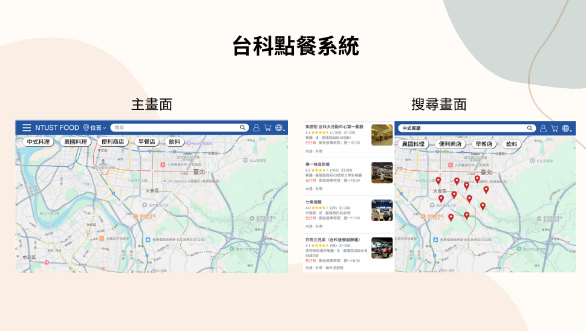
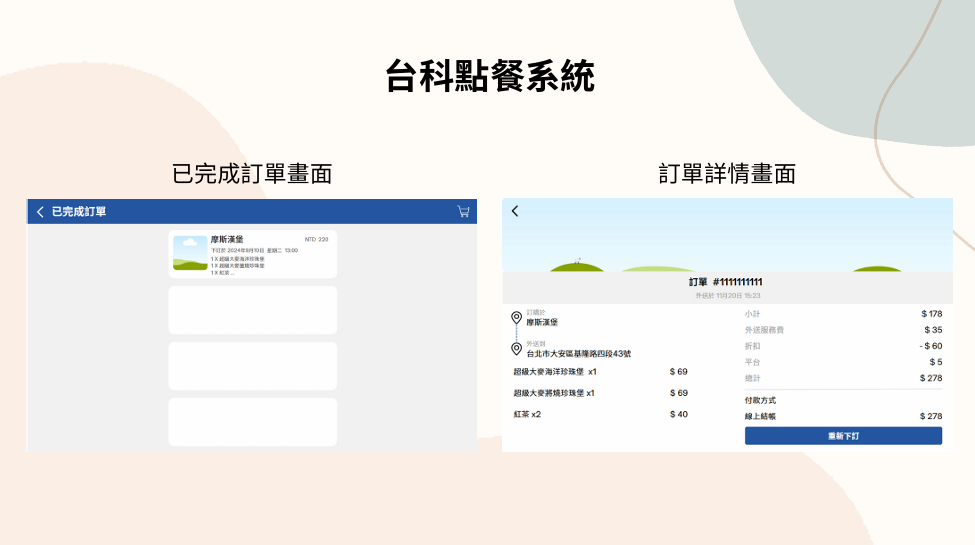

## 目錄結構

/food-ordering-system

├── /controller  # 控制器：處理業務邏輯與路由的映射  
│    ├── user.go            # 用戶相關的業務邏輯  
│    └── restaurant.go      # 餐廳管理相關的業務邏輯  
│    └── rates.go           # 餐廳評價相關的業務邏輯  
│    └── order.go           # 訂餐相關的業務邏輯  
│    └── menu.go            # 管理菜單的業務邏輯  
│  
├── /models  # 模型：資料結構和 Firebase 交互定義  
│    ├── order.go       # 點餐的數據模型  
│    └── food.go        # 食物數據模型  
│    └── menu.go        # 菜單的數據模型  
│    └── rate.go        # 評價的數據模型  
│    └── restaurant.go  # 餐廳的數據模型  
│    └── user_basic.go  # 使用者的數據模型  
│  
├── /router  # 路由：定義 HTTP 路徑與控制器的映射  
│    └── router.go  # 所有路由的統一管理  
│  
├── /utils  # 公用工具：放置一些工具函數或通用邏輯  
│    └── firebase.go  # 建立firebase資料庫
│    └── jwt.go       # token處理  
│  
├── /config  # 配置：存放專案相關的配置文件  
│  
├── go.mod  # Go module 文件，管理依賴項  
└── main.go  # 主文件，啟動 Gin 框架和 Firebase


## 如何構建與運行專案

### 1. 安裝 Golang

請先確保已安裝 Golang，可以從 [Golang 官網](https://golang.org/dl/) 下載並安裝最新版本。

### 2. 設置環境變數

你需要設置 `GOPATH` 來指向 Go 工作空間。如果你的專案位於 `D:\ProgramFile\Go\src\orderfood`，你需要將 `GOPATH` 設置為 `D:\ProgramFile\Go`。

#### Windows 上設置環境變數的步驟：

1. 右鍵 "此電腦"，選擇 "屬性"。
2. 點擊 "進階系統設定"，然後選擇 "環境變數"。
3. 在 "使用者環境變數" 下，新增或編輯 `GOPATH` 變數，設置其值為 `D:\ProgramFile\Go`。
4. 點擊 "確定" 並重新啟動命令行窗口。

### 3. 下載專案依賴項

專案使用 Go Modules 來管理依賴庫，因此你需要下載專案的所有依賴。首先，進入專案的根目錄，然後運行以下命令：

```bash
go mod download
```

## 執行畫面展示
### 主畫面 & 搜尋畫面


### 登入畫面 & 註冊畫面


### 訂單相關畫面


### 餐廳資訊畫面


## 我的貢獻
本專案為團隊合作開發，我負責部分後端功能，包括使用者登入註冊、送出訂單、餐廳評價與 API 測試等模組。
