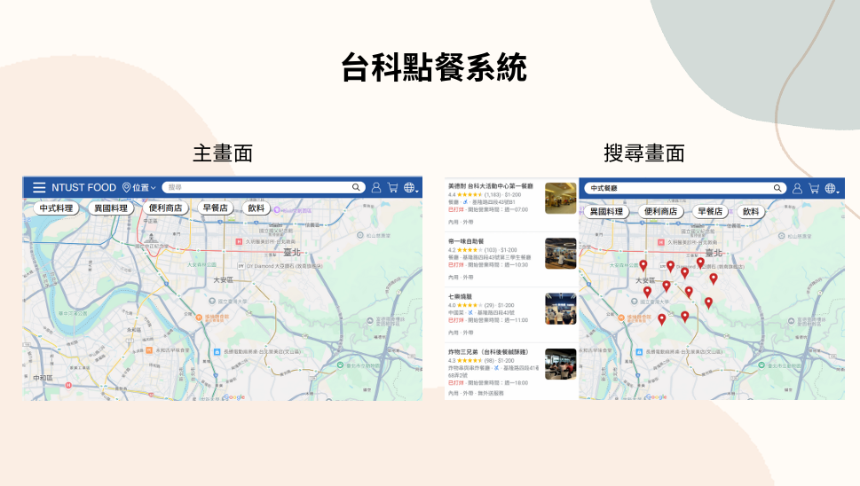
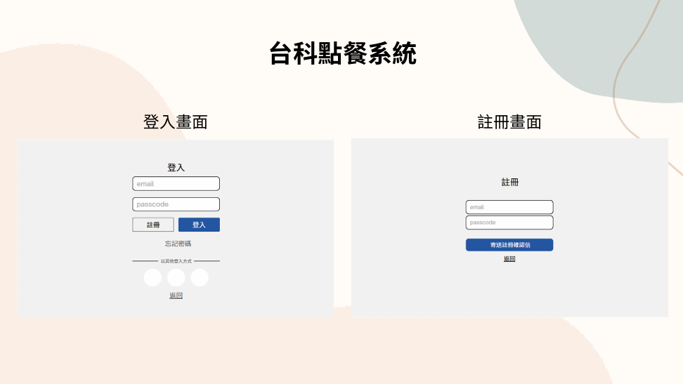
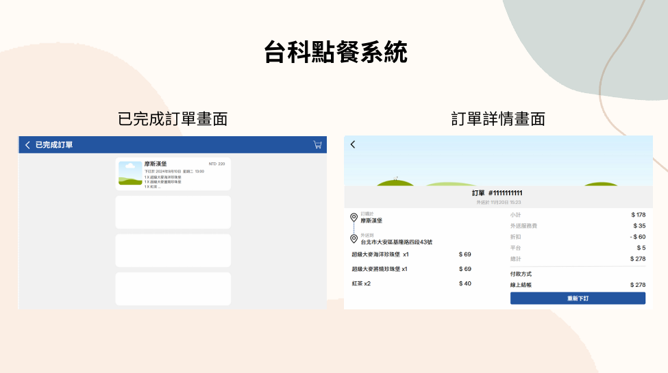
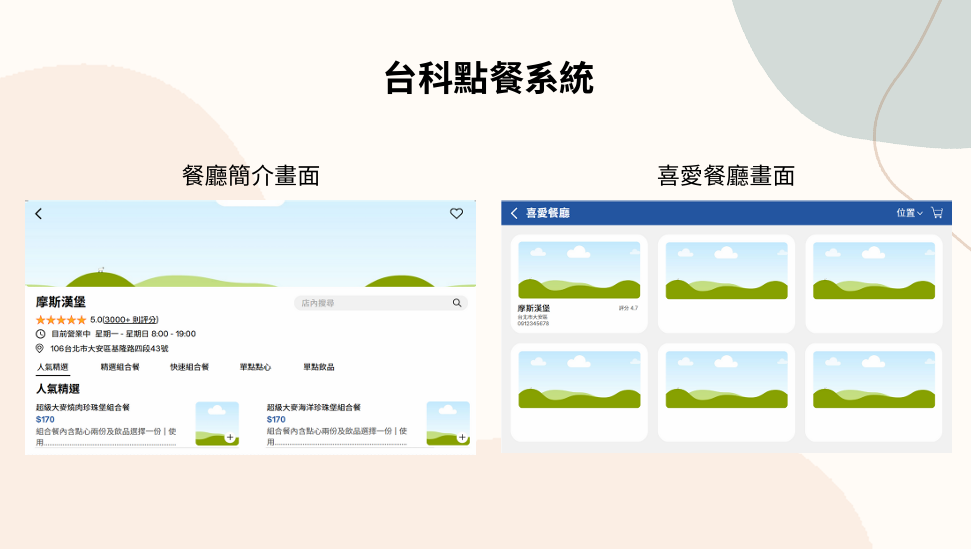

# Food Ordering System

> This project was collaboratively developed by a team of students from  
> **National Taiwan University of Science and Technology (NTUST)** – CSIE Department,  
> as part of the **Software Engineering** course project.

## Project Structure
```
/food-ordering-system

├── /controller        # Handles business logic and route handling
│    ├── user.go           # User-related operations
│    ├── restaurant.go     # Restaurant management
│    ├── rates.go          # Restaurant rating system
│    ├── order.go          # Order placement and tracking
│    └── menu.go           # Menu management
│
├── /models           # Data models and Firebase integration
│    ├── order.go          # Order data model
│    ├── food.go           # Food item data model
│    ├── menu.go           # Menu data model
│    ├── rate.go           # Rating data model
│    ├── restaurant.go     # Restaurant data model
│    └── user_basic.go     # User profile model
│
├── /router           # Route definitions and bindings
│    └── router.go         # Centralized routing
│
├── /utils            # Utility functions and helpers
│    ├── firebase.go       # Firebase initialization
│    └── jwt.go            # JWT token handling
│
├── /config           # Configuration files
│
├── go.mod            # Go module dependency file
└── main.go           # Main entry point (Gin + Firebase)

```

## Getting Started

### 1. Install Golang

Make sure Go is installed on your system. You can download the latest version from the [official website](https://golang.org/dl/).

### 2. Set Up Environment Variables

You need to set the `GOPATH` to point to your Go workspace.
For example, if your project is located at `D:\ProgramFile\Go\src\orderfood`, then `GOPATH` should be set to:
```bash
D:\ProgramFile\Go
```

#### Steps to set environment variables on Windows:

1. Right-click on This PC and select Properties
2. Click Advanced system settings, then choose Environment Variables
3. Under User variables, add or edit the variable named `GOPATH`, and set its value to `D:\ProgramFile\Go`
4. Click OK, and restart your command line window to apply the changes


### 3. Download Project Dependencies

This project uses Go Modules for dependency management.
Navigate to the project root and run the following command to download all required packages:

```bash
go mod download
```

## UI Previews
### Home & Search Page


### Login & Registration


### Order Management


### Restaurant Details


## Project Report
- [report.pdf](report.pdf)
<!--
## 我的貢獻
本專案為團隊合作開發，我主要負責後端功能，包括使用者登入註冊、送出訂單、餐廳評價與 API 測試等模組。
-->
